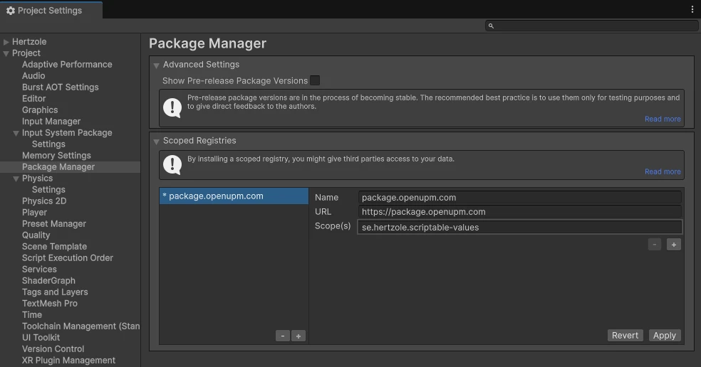

import { Steps } from '@astrojs/starlight/components';

Getting Scriptable Values up and running in your Unity project is really easy! First you just need to pick how you want it to be installed.

## Install via OpenUPM (recommended)

There are two ways to install Scriptable Values via OpenUPM: using the [OpenUPM CLI](https://openupm.com/docs/getting-started-cli.html) or using the Unity Package Manager.

### With OpenUPM CLI

If you have [OpenUPM CLI](https://openupm.com/docs/getting-started-cli.html) installed, you can run the following command in your Unity project:

```bash title="OpenUPM CLI"
openupm add se.hertzole.scriptable-values
```

### With Unity Package Manager

<Steps>

1. Open `Edit > Project Settings > Package Manager`
2. Add a new `Scoped Registry` (or edit an existing OpenUPM entry)  
    Name: `package.openupm.com`  
    URL: `https://package.openupm.com`  
    Scopes: `se.hertzole.scriptable-values`
3. Click `Save` or `Apply`

4. Open `Window > Package Manager`
5. Click the `+` button in the top left corner and select `Add package by name...` or `Add package from git URL...`
6. Enter `se.hertzole.scriptable-values` and click `Add`

</Steps>

## Install via Git URL

You can also install Scriptable Values via Git URL. This is a good option if you want to use the latest version of Scriptable Values, but it is not recommended for production projects.

<Steps>

1. Open `Window > Package Manager`
2. Click the `+` button in the top left corner and select `Add package from git URL...`
3. Paste in the decired URL and click `Add`  
    For the latest stable version:

    ```txt
    https://github.com/Hertzole/scriptable-values.git#package
    ```

    For the latest preview (**but unstable!**) version:

    ```txt
    https://github.com/Hertzole/scriptable-values.git#dev-package
    ```

4. Wait for the package to be installed

</Steps>