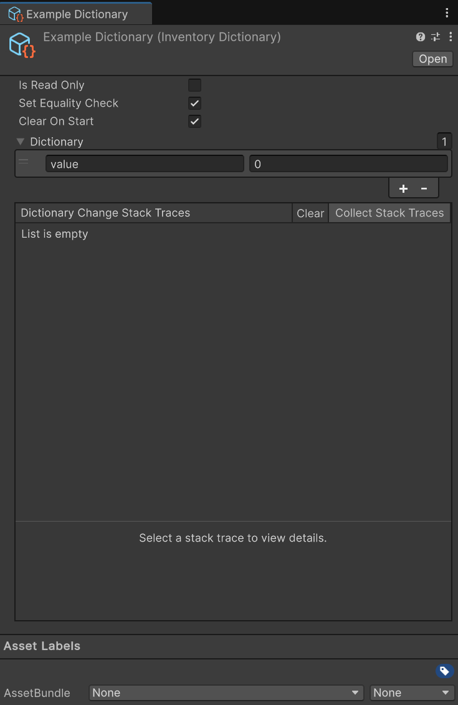

import EventReminder from '../../../components/EventReminder.mdx';
import CollectionEvent from '../../../components/CollectionEvent.mdx';
import DefaultValue from '../../../components/DefaultValue.astro';

`ScriptableDictionary<TKey, TValue>` is a type of scriptable object that holds a dictionary of values. It acts just like a regular [`Dictionary<TKey, TValue>`](https://learn.microsoft.com/en-us/dotnet/api/system.collections.generic.dictionary-2), but it is a scriptable object that can be used in the inspector and be passed around to other objects.

`ScriptableDictionary<TKey, TValue>` implements `IDictionary<TKey, TValue>`, `IReadOnlyDictionary<TKey, TValue>`, and `IDictionary`. However, it does not always expose those implemented methods. To access them you need to explicitly cast the dictionary to the interface you want to use.



## Usage

Using a Scriptable Dictionary in your code is really straight forward. You use the `Add`, `Remove`, and `Clear` methods to manage the dictionary.
:::note
To actually asign the dictionary to a field you need to create an instance of the dictionary in the editor. These instances need to be created in code first. See [Creating a Dictionary](#creating-a-dictionary) for more information.
:::

`Add` will add an object to the dictionary. The key must be unique, otherwise it will throw an exception.

```csharp title="Add Example"
using UnityEngine;
using Hertzole.ScriptableValues;

public class Inventory : MonoBehaviour
{
    [SerializeField] 
    private ScriptableDictionary<string, Item> items;

    public void AddItem(string key, Item item)
    {
        items.Add(key, item);
    }
}
```

`Remove` will remove an object from the dictionary.

```csharp title="Remove Example"
using UnityEngine;
using Hertzole.ScriptableValues;

public class Inventory : MonoBehaviour
{
    [SerializeField] 
    private ScriptableDictionary<string, Item> items;

    public void RemoveItem(string key)
    {
        items.Remove(key);
    }
}
```

`Clear` will remove all objects from the dictionary. This is useful for cleaning up the dictionary when it is no longer needed, like when quitting or changing scenes.

```csharp title="Clear Example"
using UnityEngine;
using Hertzole.ScriptableValues;

public class Inventory : MonoBehaviour
{
    [SerializeField] 
    private ScriptableDictionary<string, Item> items;

    public void Clear()
    {
        items.Clear();
    }
}
```

You can also access the dictionary directly using the indexer. This is useful for getting or setting values in the dictionary.

```csharp title="Indexer Example"
using UnityEngine;
using Hertzole.ScriptableValues;

public class Inventory : MonoBehaviour
{
    [SerializeField] 
    private ScriptableDictionary<string, Item> items;

    public void SetItem(string key, Item item)
    {
        items[key] = item;
    }

    public Item GetItem(string key)
    {
        return items[key];
    }
}
```

You can listen to changes in the dictionary using the `OnCollectionChanged` event.

```csharp title="Listening Example"
using UnityEngine;
using Hertzole.ScriptableValues;
using System.Collections.Specialized;

public class Inventory : MonoBehaviour
{
    [SerializeField] 
    private ScriptableDictionary<string, Item> items;

    private void OnEnable()
    {
        items.OnCollectionChanged += OnDictionaryChanged;
    }

    private void OnDisable()
    {
        items.OnCollectionChanged -= OnDictionaryChanged;
    }

    // Note that the item type is KeyValuePair<TKey, TValue>
    private void OnDictionaryChanged(CollectionChangedArgs<KeyValuePair<string, Item>> args)
    {
        // Action is a NotifyCollectionChangedAction
        Debug.Log("Action: " + args.Action);
        // New Index is the index of the item(s) that was added
        Debug.Log("New Index: " + args.NewIndex);
        // Old Index is the index of the item(s) that was removed
        Debug.Log("Old Index: " + args.OldIndex);
        // New Items is the item(s) that was added as a Memory<T>
        Debug.Log("New Items: " + args.NewItems);
        // Old Items is the item(s) that was removed as a Memory<T>
        Debug.Log("Old Items: " + args.OldItems);
    }
}
```

<EventReminder/>

There are many more methods available in the dictionary, such as `ContainsKey`, `TryGetValue`, and `Count`. You can find the full list of methods in the [documentation](https://learn.microsoft.com/en-us/dotnet/api/system.collections.generic.dictionary-2).

### Listening to Collections

<CollectionEvent/>

## Properties

The following properties are available on all Scriptable List:

### Is Read Only

<DefaultValue enabled={false}/>
Marks the scriptable dictionary as read-only. This means that the dictionary cannot be changed at runtime and will always have the same value. This is useful for dictionary that are set in the editor and should not be changed at runtime.

### Set Equality Check

<DefaultValue enabled={true}/>
When this is enabled `OnCollectionChanged` will not be triggered when a dictionary item is set to the same value as it already has. This is useful for dictionaries that are set frequently and should not trigger the events when the value is the same.

### Clear On Start

<DefaultValue enabled={true}/>
Clears the dictionary when the game starts. This is useful for dictionaries that should be cleared when the game starts, such as a dictionary of inventory items. Disabling this will keep the dictionary from the last play session.
:::caution
This does not mean that the dictionary will be saved! Restarting the Unity editor will clear the dictionary. It will just persist between editor play sessions.
:::

### Comparer

The comparer used to compare the keys in the dictionary. This is useful for custom types that need a custom comparer. The default is `EqualityComparer<TKey>.Default`, which uses the default equality comparer for the type.

### Count

The actual number of items in the list.

### Keys

A collection of the current keys in the dictionary.

### Values

A collection of the current values in the dictionary.

## Creating a Dictionary

You need to create a dictionary before you can use it in the editor. Fortunately, this is really easy to do! All you need to do is inherit from `ScriptableDictionary<TKey, TValue>`.

```csharp title="Creating a Dictionary"
using UnityEngine;
using Hertzole.ScriptableValues;

[CreateAssetMenu(fileName = "New Item Dictionary", menuName = "Scriptable Values/Dictionary")]
public class ItemDictionary : ScriptableDictionary<string, Item>
{
    // You can add any custom methods or properties here.
    // There are no methods to override, but you can add your own methods.
}
```