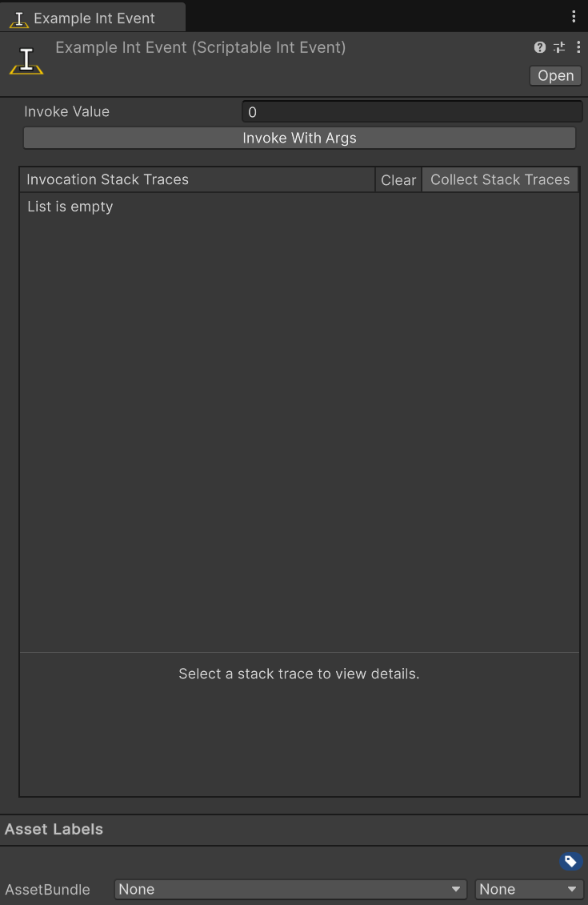

import EventReminder from '../../../components/EventReminder.mdx';

All the types that inherit from `ScriptableEvent<T>` are events. They can be used to invoke events with a single argument (or no argument).

They are always named along the lines of `ScriptableTypeEvent`. For example: `ScriptableBoolEvent`, `ScriptableFloatEvent`, and `ScriptableVector3Event`.



## Usage

Using a Scriptable Event in your code is really straight forward. You can use the `Invoke` method to invoke the event. For example:

```csharp
using Hertzole.ScriptableValues;
using UnityEngine;

public class PlayerHealth : MonoBehaviour
{
    public ScriptableIntEvent onHealthChanged;

    private int currentHealth = 100;

    public void TakeDamage(int damage)
    {
        currentHealth -= damage;
        // Passing 'this' as the sender so we know what invoked the event
        onHealthChanged.Invoke(this, currentHealth);
    }
}
```

Then you can use the events to get notified when the event is invoked. For example:

```csharp
using Hertzole.ScriptableValues;
using UnityEngine;
using UnityEngine.UI;

public class HealthUI : MonoBehaviour
{
    public ScriptableIntEvent onHealthChanged;
    public Text healthText;

    private void OnEnable()
    {
        onHealthChanged.OnInvoked += OnHealthChanged;
    }

    private void OnDisable()
    {
        onHealthChanged.OnInvoked -= OnHealthChanged;
    }

    private void OnHealthChanged(object sender, int newValue)
    {
        healthText.text = "Health: " + newValue.ToString();
    }
}
```

<EventReminder/>

## Included Types

The following types are included:

- `bool`
- `Bounds`
- `BoundsInt`
- `byte`
- `char`
- `Color`
- `Color32`
- `decimal`
- `double`
- `float`
- `int`
- `long`
- `Quaternion`
- `Rect`
- `RectInt`
- `sbyte`
- `short`
- `string`
- `uint`
- `ulong`
- `ushort`
- `Vector2`
- `Vector2Int`
- `Vector3`
- `Vector3Int`
- `Vector4`

A Scriptable Event without any args is also included, simply just called `ScriptableEvent`. This is useful for events that don't need any arguments.

## Creating Your Own Scriptable Event

Creating your own Scriptable Event is really easy! All you need to do is inherit from `ScriptableEvent<T>`.

```csharp
using Hertzole.ScriptableValues;
using UnityEngine;

[CreateAssetMenu]
public class ScriptableMyTypeEvent : ScriptableEvent<MyType>
{
    // You can add any custom logic here if you want
}
```

If you want to extend the functionality of your own Scriptable Event you can override a few methods.

```csharp
using Hertzole.ScriptableValues;
using UnityEngine;

[CreateAssetMenu]
public class ScriptableMyTypeEvent : ScriptableEvent<MyType>
{
    // Called before the event is invoked
    protected override bool OnBeforeInvoked(object sender, MyType args)
    {
        // Do something before the event is invoked
        return true; // Return false to prevent the event from being invoked
    }

     // Called after the event has been invoked
    protected override void OnAfterInvoked(object sender, MyType args))
    {
        // Do something after the event has been invoked
    }
}
```