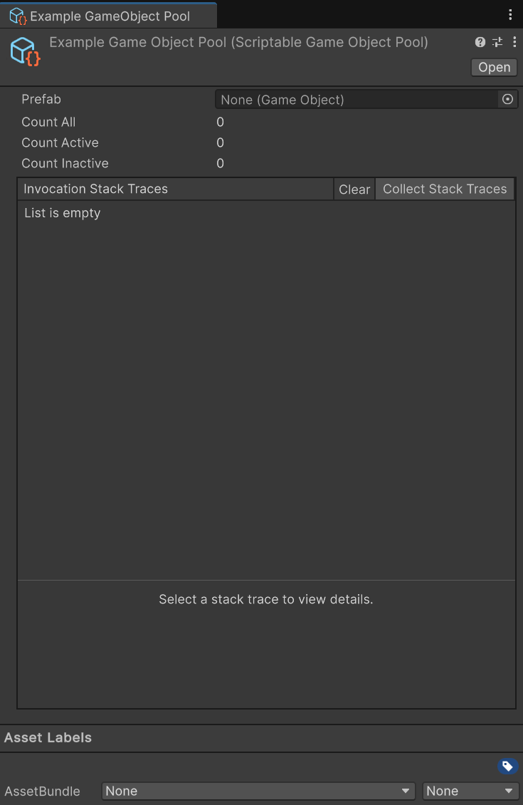

import { Steps } from '@astrojs/starlight/components';
import EventReminder from '../../../components/EventReminder.mdx';

`ScriptablePool<T>` is a type of scriptable object that holds a [object pool](https://docs.unity3d.com/ScriptReference/Pool.ObjectPool_1.html). This can be used to create a pool of objects that can be reused. This is useful for performance reasons, as it reduces the number of objects that need to be created and destroyed. The scriptable pool can easily be passed around to objects that need to use it.



## Usage

Using a Scriptable Pool in your code is really straight forward. You use the `Get`, `Release`, and `Clear` methods to manage the pool.

:::note
To actually asign the pool to a field you need to create an instance of the pool in the editor. These instances need to be created in code first. See [Creating a Pool](#creating-a-pool) for more information.
:::

`Get` will return an object from the pool. If there are no objects available in the pool, it will create a new one and add it to the pool.

```csharp title="Get Example"
using UnityEngine;
using Hertzole.ScriptableValues;

public class EnemySpawner : MonoBehaviour
{
    [SerializeField] 
    private ScriptablePool<Enemy> pool;

    public void SpawnEnemy(Vector3 position)
    {
        Enemy enemy = pool.Get();
        enemy.transform.position = position;
        enemy.gameObject.SetActive(true);
    }
}
```

`Release` will return an object to the pool for later use.

```csharp title="Release Example"
using UnityEngine;
using Hertzole.ScriptableValues;

public class Enemy : MonoBehaviour
{
    [SerializeField] 
    private ScriptablePool<Enemy> pool;

    public void Die()
    {
        gameObject.SetActive(false);
        pool.Release(this);
    }
}
```

`Clear` will remove all objects from the pool and destroy **both active and inactive** objects. This is useful for cleaning up the pool when it is no longer needed, like when quitting or changing scenes.

```csharp title="Clear Example"
using UnityEngine;
using Hertzole.ScriptableValues;

public class EnemyManager : MonoBehaviour
{
    [SerializeField] 
    private ScriptablePool<Enemy> pool;

    private void OnDestroy()
    {
        pool.Clear();
    }
}
```

You can also listen to changes in the pool.

```csharp title="Listening to Pool Changes"
using UnityEngine;
using Hertzole.ScriptableValues;

public class EnemyManager : MonoBehaviour
{
    [SerializeField] 
    private ScriptablePool<Enemy> pool;

    private void OnEnable()
    {
        pool.OnPoolChanged += OnPoolChanged;
    }

    private void OnDisable()
    {
        pool.OnPoolChanged -= OnPoolChanged;
    }

    private void OnPoolChanged(PoolAction action, Enemy item)
    {
        // Use action to determine what happened.
        // Item is the object that was affected by the action.
        // PoolAction.CreatedObject
        //   The object that was created because the pool was empty.
        // PoolAction.DestroyObject
        //   The object that will be destroyed because the pool was cleared.
        // PoolAction.RentedObject
        //   The object that was rented from the pool.
        // PoolAction.ReleasedObject
        //   The object that was released back to the pool.
    }
}
```

<EventReminder/>

## `IPoolable` Interface

If you want to be notified when an object is added to or removed from the pool, you can implement the `IPoolable` interface on your class. This interface has two methods: `OnPooled` and `OnUnpooled`. These methods will be called when the object is added to or removed from the pool, respectively. It can be implemented on normal classes, MonoBehaviours, or Scriptable Objects.

```csharp title="IPoolable Example"
using UnityEngine;
using Hertzole.ScriptableValues;

public class Enemy : MonoBehaviour, IPoolable
{
    public void OnPooled()
    {
        // Called when the object is added to the pool
        // Reset the state of the object here
    }

    public void OnUnpooled()
    {
        // Called when the object is removed from the pool
        // Clean up the state of the object here
    }
}
```

All scriptable pools will automatically call these methods when the object is added to or removed from the pool. 

:::caution
[Scriptable Component Pool](#scriptable-component-pool) and [Scriptable GameObject Pool](#scriptable-gameobject-pool) calls these methods on *all* components on the object. This means that if you have multiple components that implement `IPoolable`, they will all be called when the object is added to or removed from the pool.
:::

## Pool Types

There are a few included pool types that you can use that are based on the `ScriptablePool<T>` class. They may be more useful for your use case than the generic pool. The following pool types are included:

### Scriptable Component Pool

`ScriptableComponentPool<T>` is a pool that holds a prefab for an object that has a component of type `T`. This type automatically handles instantiating the prefab and destroying it when the pool is cleared. It also handles activating and deactivating the objects when they are used.

```csharp title="Scriptable Component Pool Example"
using UnityEngine;
using Hertzole.ScriptableValues;

public class EnemyManager : MonoBehaviour
{
    [SerializeField] 
    private ScriptableComponentPool<Enemy> pool;

    public void SpawnEnemy(Vector3 position)
    {
        Enemy enemy = pool.Get();
        // No need to activate the enemy using SetActive(true)
        enemy.transform.position = position;
        enemy.Health = 100;
    }

    public void KillEnemy(Enemy enemy)
    {
        pool.Release(enemy);
        // No need to deactivate the enemy using SetActive(false)
    }

    private void OnDestroy()
    {
        pool.Clear();
        // Will destroy all the enemies from the pool
    }
}
```

### Scriptable GameObject Pool

`ScriptableGameObjectPool` is a pool that holds a prefab for any [GameObject](https://docs.unity3d.com/Manual/class-GameObject.html). This type automatically handles instantiating the prefab and destroying it when the pool is cleared. It also handles activating and deactivating the objects when they are used.

```csharp title="Scriptable GameObject Pool Example"
using UnityEngine;
using Hertzole.ScriptableValues;

public class EnemyManager : MonoBehaviour
{
    [SerializeField] 
    private ScriptableGameObjectPool pool;

    public void SpawnEnemy(Vector3 position)
    {
        GameObject enemy = pool.Get();
        // No need to activate the enemy using SetActive(true)
        enemy.transform.position = position;
        // Now you need to use GetComponent to get the enemy component
        enemy.GetComponent<Enemy>().Health = 100;
    }

    public void KillEnemy(GameObject enemy)
    {
        pool.Release(enemy);
        // No need to deactivate the enemy using SetActive(false)
    }

    private void OnDestroy()
    {
        pool.Clear();
        // Will destroy all the enemies from the pool
    }
}
```

### Scriptable Object Pool

`ScriptableObjectPool<T>` is a pool that automatically creates instances of [ScriptableObjects](https://docs.unity3d.com/Manual/class-ScriptableObject.html) of type `T`. This types automatically handles instantiating the scriptable objects and destroying them when the pool is cleared.

## Creating a Pool

You need to create a pool first before you can use it in the editor. Fortunately, this is really easy to do!

<Steps>

1. First decide what type of pool you want to create. It all depends on what type of object you want to pool.

    | Type to pool | Pool type to use |
    |--------------|------------------|
    | MonoBehaviour/Component | [`ScriptableComponentPool<T>`](#scriptable-component-pool) |
    | ScriptableObject | [`ScriptableObjectPool<T>`](#scriptable-object-pool) |
    | Any C# class | `ScriptablePool<T>` |

2. Inherit from the pool type you want to use.

    ```csharp title="Creating a Component Pool"
    using Hertzole.ScriptableValues;
    using UnityEngine;

    [CreateAssetMenu(fileName = "EnemyPool", menuName = "Scriptable Values/Scriptable Pools/Enemy Pool")]
    public class EnemyPool : ScriptableComponentPool<Enemy>
    {
        // You can add any custom functionality here
    }
    ```

3. If you are inherting from just `ScriptablePool<T>`, you need to implement the `CreateObject` and `DestroyObject` methods.

    ```csharp title="Creating a Pool"
    using Hertzole.ScriptableValues;
    using UnityEngine;

    [CreateAssetMenu(fileName = "EnemyPool", menuName = "Scriptable Values/Scriptable Pools/Enemy Pool")]
    public class EnemyDataPool : ScriptablePool<EnemyData>
    {
        protected override EnemyData CreateObject()
        {
            // Create a new instance of the object here.
            return new EnemyData();
        }

        protected override void DestroyObject(EnemyData item)
        {
            // Do any cleanup here.
            // Sometimes you may want to do nothing here.
        }
    }
    ```

</Steps>