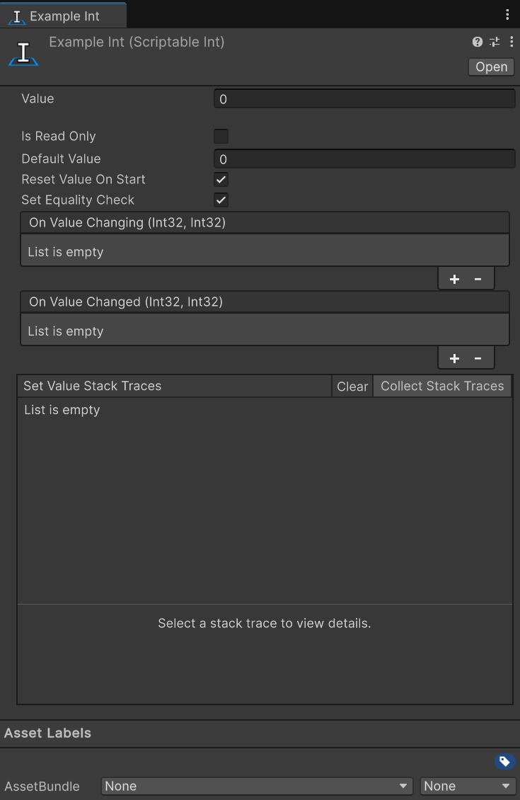

import EventReminder from '../../../components/EventReminder.mdx';
import DefaultValue from '../../../components/DefaultValue.astro';

All the types that inherit from `ScriptableValue<T>` are values. They are the most basic type of Scriptable Value and are used to store a single value.

They are always named along the lines of `ScriptableType`. For example: `ScriptableBool`, `ScriptableFloat`, and `ScriptableVector3`.



## Usage

Using a Scriptable Value in your code is really straight forward. You can use the `Value` property to get or set the value of the Scriptable Value. For example:

```csharp
using Hertzole.ScriptableValues;
using UnityEngine;

public class PlayerHealth : MonoBehaviour
{
    public ScriptableInt health;

    public void TakeDamage(int damage)
    {
        health.Value -= damage;
    }
}
```

Then you can use the events to get notified when the value changes. For example:

```csharp
using Hertzole.ScriptableValues;
using UnityEngine;
using UnityEngine.UI;

public class HealthUI : MonoBehaviour
{
    public ScriptableInt health;
    public Text healthText;

    private void OnEnable()
    {
        health.OnValueChanged += OnHealthChanged;
    }

    private void OnDisable()
    {
        health.OnValueChanged -= OnHealthChanged;
    }

    private void OnHealthChanged(int oldValue, int newValue)
    {
        healthText.text = "Health: " + newValue.ToString();
    }
}
```
You can also use the `OnValueChanging` event to get notified when the value is about to change.


<EventReminder/>

## Included Types

The following types are included for your convenience:

- `bool`
- `Bounds`
- `BoundsInt`
- `byte`
- `char`
- `Color`
- `Color32`
- `decimal`
- `double`
- `float`
- `int`
- `long`
- `Quaternion`
- `Rect`
- `RectInt`
- `sbyte`
- `short`
- `string`
- `uint`
- `ulong`
- `ushort`
- `Vector2`
- `Vector2Int`
- `Vector3`
- `Vector3Int`
- `Vector4`

## Propereties

The following properties are available on all Scriptable Values:

### Is Read Only 

<DefaultValue enabled={false}/>
Marks the scriptable value as read-only. This means that the value cannot be changed at runtime and will always have the same value. This is useful for values that are set in the editor and should not be changed at runtime.

### Reset Value On Start

<DefaultValue enabled={true}/>
Resets the value to the default value when the game starts. This is useful for values that should be reset to a default value when the game starts, such as a health value or a score value. Disabling this will keep the value from the last play session.
:::caution
This does not mean that the value will be saved! Restarting the Unity editor will reset the value to the default value. They will just persist between editor play sessions.
:::

### Set Equality Check

<DefaultValue enabled={true}/>
When this is enabled `OnValueChanging` and `OnValueChanged` will not be triggered when the value is set to the same value as it already has. This is useful for values that are set frequently and should not trigger the events when the value is the same.

### Value

The current value of the Scriptable Value. This is the value that will be used when the game is running. Changing this value in the editor or by script via `Value` will trigger the `OnValueChanging` and `OnValueChanged` events. 

### Default Value

The default value of the Scriptable Value. This is the value that will be used when the game starts if [Reset Value On Start](#reset-value-on-start) is enabled. This value can be changed in the editor and will not trigger the `OnValueChanging` and `OnValueChanged` events.

## Creating Your Own Scriptable Value

Creating your own Scriptable Value is really easy! All you need to do is inherit from `ScriptableValue<T>`.

```csharp
using Hertzole.ScriptableValues;
using UnityEngine;

[CreateAssetMenu]
public class MyScriptableValue : ScriptableValue<int>
{
    // You can add your own properties and methods here
}
```

If you want to extend the functionality of your own Scriptable Value you can override a few methods.

```csharp
using Hertzole.ScriptableValues;
using UnityEngine;

[CreateAssetMenu]
public class MyScriptableValue : ScriptableValue<int>
{
    // Called before the value is changed
    protected override bool OnBeforeSetValue(int newValue)
    {
        // Do something before the value is set
        return true; // Return false to cancel the change
    }

    // Called after the value is changed
    protected override void OnAfterSetValue(int oldValue, int newValue)
    {
        // Do something after the value is set
    }
}
```

There are more methods you can use and need to be mindfull of when using. See [Creating Custom Types](/scriptable-values/guides/creating-custom-types) for more information.
